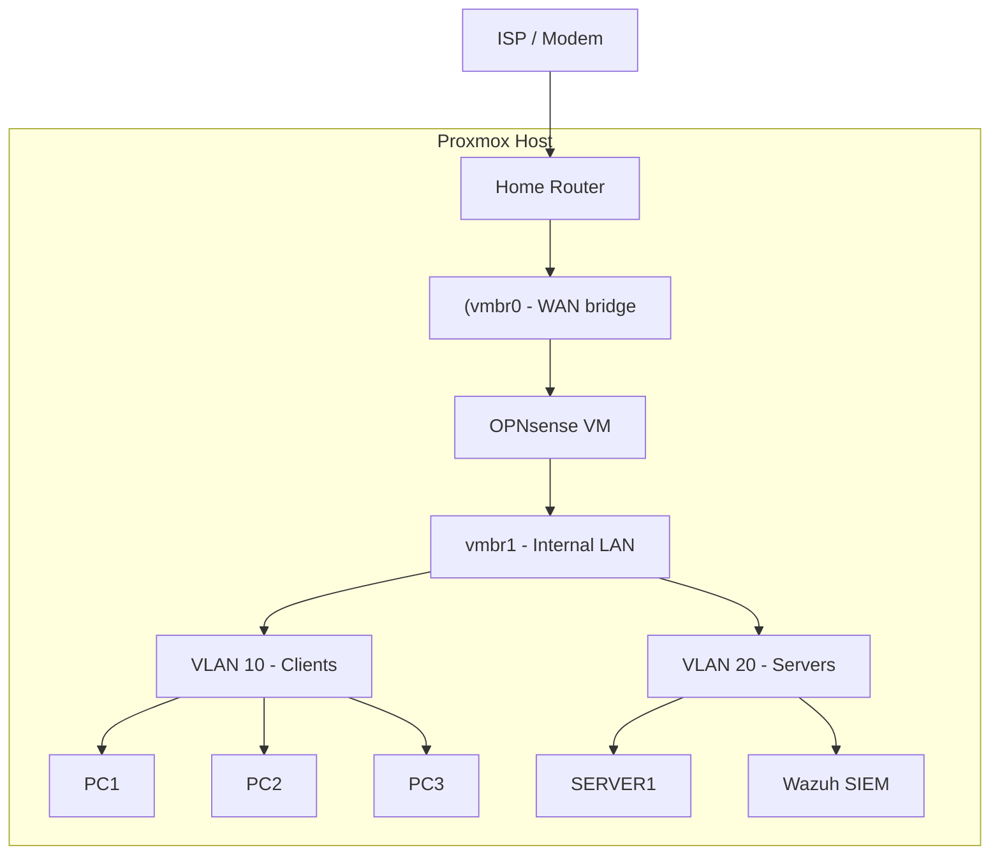

Network Layout:

```mermaid
graph TD
    ISP["ISP / Modem"] --> PhysicalRouter["Home Router"]
    subgraph Proxmox Host
      PhysicalRouter --> ProxmoxNIC["(vmbr0 - WAN bridge"]
      ProxmoxNIC --> OPNsense["OPNsense VM"]
      OPNsense --> vmbr1["vmbr1 - Internal LAN"]
      vmbr1 --> VLAN10["VLAN 10 - Clients"]
      VLAN10 --> PC1[PC1]
      VLAN10 --> PC2[PC2]
      VLAN10 --> PC3[PC3]
      vmbr1 --> VLAN20["VLAN 20 - Servers"]
      VLAN20 --> SEVER1["SERVER1"]
      VLAN20 --> Wazuh["Wazuh SIEM"]
    end
```
